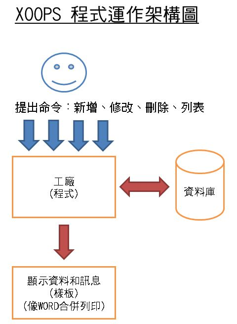

# 設計模組

* [電子書 - XOOPS模組開發](http://campus-xoops.tn.edu.tw/modules/tad_book3/index.php?op=list_docs&tbsn=4) 
* [Tad 教材網電子書](http://www.tad0616.net/modules/tad_book3/)
 
>

### 其他
* [Sublime Text 3 新手上路：必要的安裝、設定與基本使用教學](http://blog.miniasp.com/post/2014/01/07/Useful-tool-Sublime-Text-3-Quick-Start.aspx)
* [參考一](https://sites.google.com/site/xoopsmozuzhizuo/)
* [模組產生器](http://www.myeasy.tw/modules/tad_xmod_maker/index.php?op=mkmod&modsn=42)
* [XOOPS表單範例](http://163.16.182.100/modules/XoopsForm/)