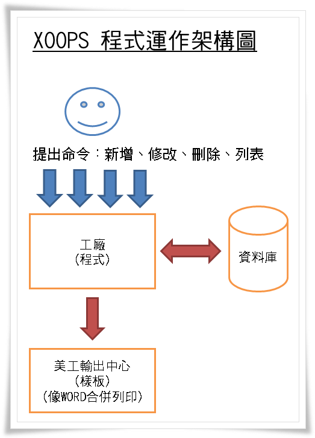

# 設計模組

* [電子書 - XOOPS模組開發](http://campus-xoops.tn.edu.tw/modules/tad_book3/index.php?op=list_docs&tbsn=4) 
* [Tad 教材網電子書](http://www.tad0616.net/modules/tad_book3/)
 


### 參考資料
* [Sublime Text 3 新手上路：必要的安裝、設定與基本使用教學](http://blog.miniasp.com/post/2014/01/07/Useful-tool-Sublime-Text-3-Quick-Start.aspx)
* [參考一](https://sites.google.com/site/xoopsmozuzhizuo/)
* [模組產生器](http://www.myeasy.tw/modules/tad_xmod_maker/index.php?op=mkmod&modsn=42)
* [XOOPS表單範例](http://163.16.182.100/modules/XoopsForm/)
 
### 程式碼
拷貝以下程式碼的方法：用滑鼠在程式碼開頭的地方點一下，在程式碼結束的地方用鍵盤 Shift 加上滑鼠點一下。

>xoops_version.php

```php
<?php
$modversion = array();

//---模組基本資訊---//
$modversion['name'] = "校園佈告欄";
$modversion['version'] = 1.00;
$modversion['description'] = "校園佈告欄";
$modversion['author'] = "tad";
$modversion['credits'] = "";
$modversion['help'] = 'page=help';
$modversion['license'] = 'GNU GPL 2.0';
$modversion['license_url'] = 'www.gnu.org/licenses/gpl-2.0.html/';
$modversion['image'] = "images/logo.png";
$modversion['dirname'] = basename(dirname(__FILE__));

//---模組狀態資訊---//
$modversion['release_date'] = '2015/07/14';
$modversion['module_website_url'] = 'http://www.yces.chc.edu.tw';
$modversion['module_website_name'] = '永靖國小';
$modversion['module_status'] = 'release';
$modversion['author_website_url'] = '';
$modversion['author_website_name'] = '';
$modversion['min_php']=5.2;
$modversion['min_xoops']='2.5';

//---paypal資訊---//
$modversion ['paypal'] = array();
$modversion ['paypal']['business'] = 'hsienhsi@yces.chc.edu.tw';
$modversion ['paypal']['item_name'] = 'Donation :永靖國小';
$modversion ['paypal']['amount'] = 1;
$modversion ['paypal']['currency_code'] = 'USD';


//---後台使用系統選單---//
$modversion['system_menu'] = 1;


//---模組資料表架構---//
$modversion['sqlfile']['mysql'] = 'sql/mysql.sql';
$modversion['tables'][0] = 'school_news';


//---後台管理介面設定---//
$modversion['hasAdmin'] = 1;
$modversion['adminindex'] = 'admin/index.php';
$modversion['adminmenu'] = 'admin/menu.php';


//---前台主選單設定---//
$modversion['hasMain'] = 1;
//$modversion['sub'][1]['name'] = '';
//$modversion['sub'][1]['url'] = '';


//---模組自動功能---//
//$modversion['onInstall'] = "include/install.php";
//$modversion['onUpdate'] = "include/update.php";
//$modversion['onUninstall'] = "include/onUninstall.php";


//---樣板設定---//
$modversion['templates'] = array();
$i=0;
$modversion['templates'][$i]['file'] = 'school_news_adm_main.html';
$modversion['templates'][$i]['description'] = 'school_news_adm_main.html';

$i++;
$modversion['templates'][$i]['file'] = 'school_news_index.html';
$modversion['templates'][$i]['description'] = 'school_news_index.html';


//---搜尋---//
//$modversion['hasSearch'] = 1;
//$modversion['search']['file'] = "include/search.php";
//$modversion['search']['func'] = "搜尋函數名稱";


//---評論---//
//$modversion['hasComments'] = 1;
//$modversion['comments']['pageName'] = '單一頁面.php';
//$modversion['comments']['itemName'] = '流水號欄位';


//---偏好設定---//
$modversion['config'] = array();
$i=0;
//$modversion['config'][$i]['name']	= '偏好設定名稱（英文）';
//$modversion['config'][$i]['title']	= '偏好設定標題（常數）';
//$modversion['config'][$i]['description']	= '偏好設定說明（常數）';
//$modversion['config'][$i]['formtype']	= '輸入表單類型';
//$modversion['config'][$i]['valuetype']	= '輸入值類型';
//$modversion['config'][$i]['default']	= 預設值;
//$i++;


//---區塊設定---//
//$modversion['blocks'] = array();
$i=1;
//$modversion['blocks'][$i]['file'] = "區塊檔.php";
//$modversion['blocks'][$i]['name'] = 區塊名稱（常數）;
//$modversion['blocks'][$i]['description'] = 區塊說明（常數）;
//$modversion['blocks'][$i]['show_func'] = "執行區塊函數名稱";
//$modversion['blocks'][$i]['template'] = "區塊樣板.html";
//$modversion['blocks'][$i]['edit_func'] = "編輯區塊函數名稱";
//$modversion['blocks'][$i]['options'] = "設定值1|設定值2";
//$i++;

//---通知---//
//$modversion['hasNotification'] = 1;

```
>admin/menu.php   
```php
<?php
$adminmenu = array();
$icon_dir=substr(XOOPS_VERSION,6,3)=='2.6'?"":"images/";

$i = 1;
$adminmenu[$i]['title'] = _MI_TAD_ADMIN_HOME ;
$adminmenu[$i]['link'] = 'admin/index.php' ;
$adminmenu[$i]['desc'] = _MI_TAD_ADMIN_HOME_DESC ;
$adminmenu[$i]['icon'] = 'images/admin/home.png' ;


$i++;
$adminmenu[$i]['title'] = '新聞管理';
$adminmenu[$i]['link'] = "admin/main.php";
$adminmenu[$i]['desc'] = '新聞管理介面' ;
$adminmenu[$i]['icon'] = "images/admin/home.png";


$i++;
$adminmenu[$i]['title'] = _MI_TAD_ADMIN_ABOUT;
$adminmenu[$i]['link'] = 'admin/about.php';
$adminmenu[$i]['desc'] = _MI_TAD_ADMIN_ABOUT_DESC;
$adminmenu[$i]['icon'] = 'images/admin/about.png';
?>
```