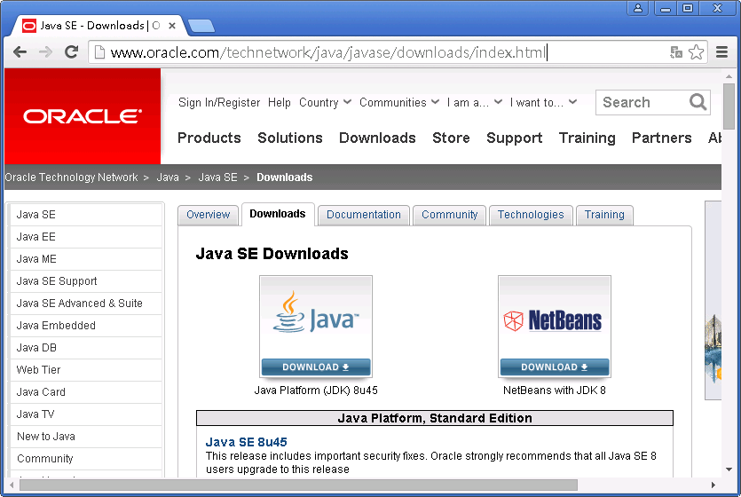
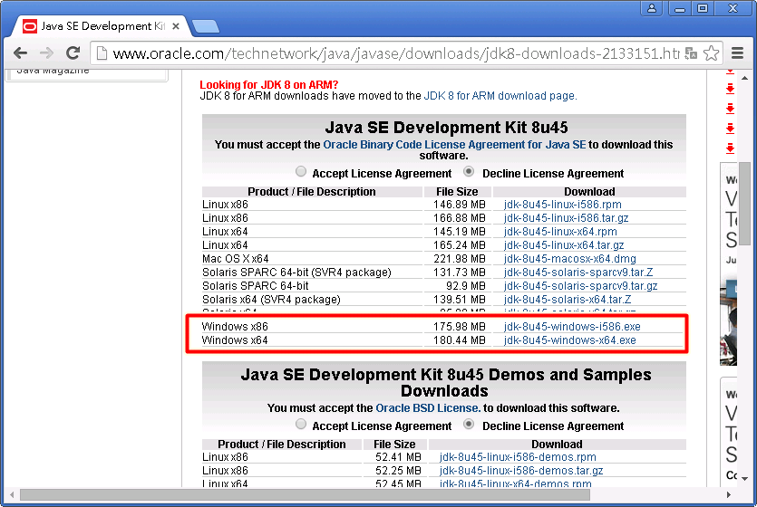
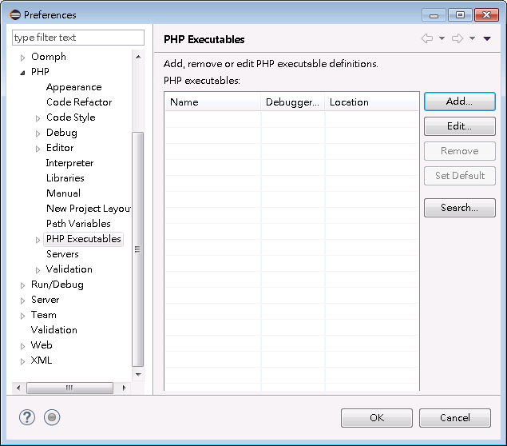
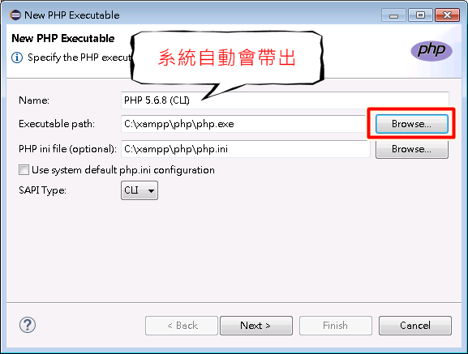
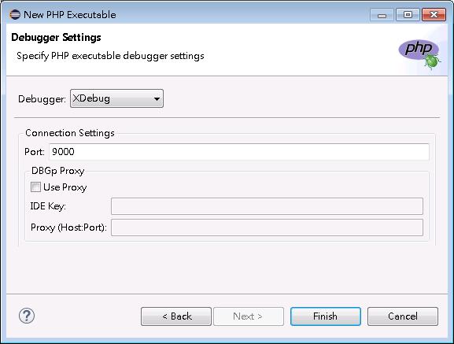
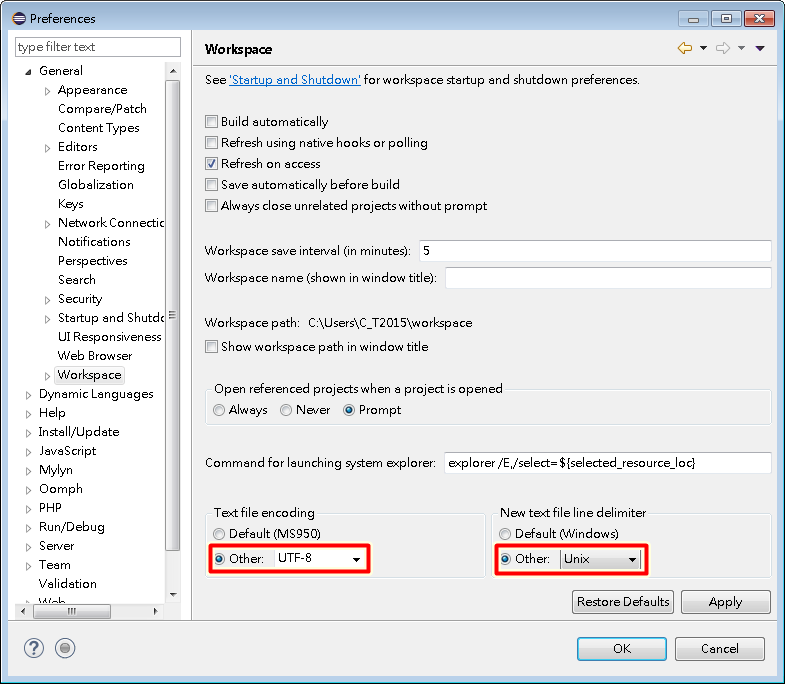
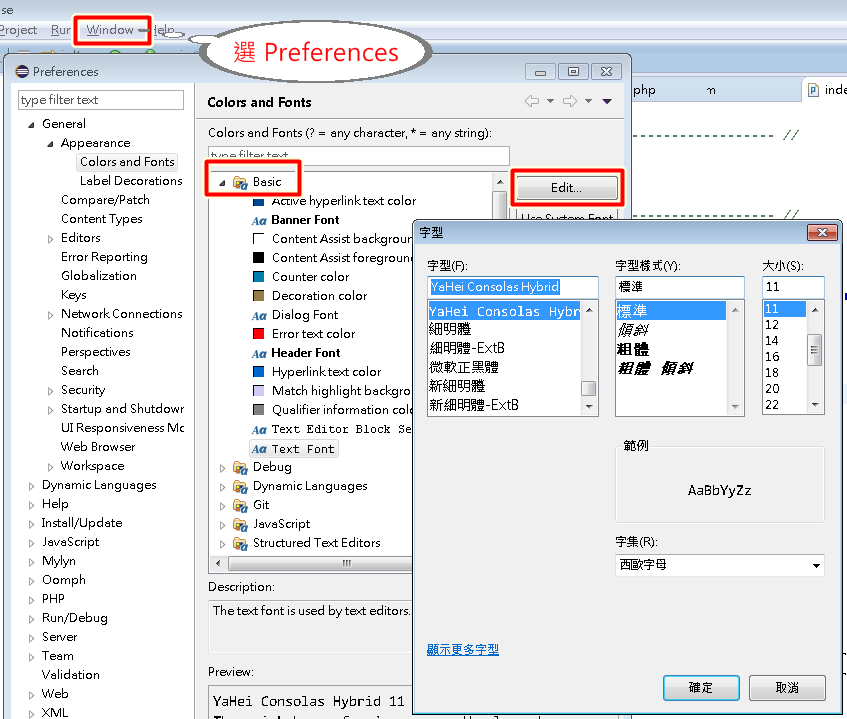

# Eclipse
### 下載
* [Eclipse for PHP Developers](http://www.eclipse.org/downloads/packages/eclipse-php-developers/marsr)

* [Java SE Downloads](http://www.oracle.com/technetwork/java/javase/downloads/index.html)

* 設定 XDebug

* UTF-8 格式  

* 修改字體
[下載雅黑字體](http://pan.baidu.com/wap/link?uk=2617758444&shareid=2713699767&third=0)  

   
   
### 參考資料
1. [在Eclipse上用Xdebug對PHP程式進行除錯(Debug)](http://blog.xuite.net/ahdaa/blog1/42927649)
2. [Eclipse 偏好設定](http://j796160836.pixnet.net/blog/post/31387535)
3. [雅黑字體](http://pan.baidu.com/wap/link?uk=2617758444&shareid=2713699767&third=0)
4. [Joomla下的Eclipse設定](https://docs.joomla.org/Configuring_Eclipse_for_joomla_development)