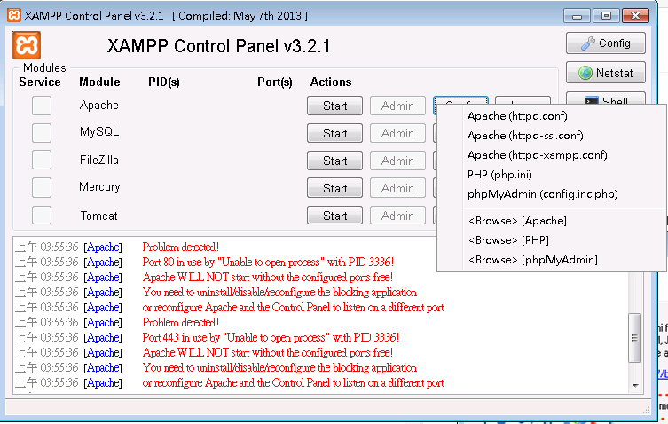

# 安裝 XAMPP

### 下載

https://www.apachefriends.org

以下示範版本 5.5.24 和 5.6.8


### 安裝

1. Learn more about Bitnami for XAMPP 可以不用勾選


2. 開放防火牆


3. 安裝完成，啟動XAMPP控制台


4. 修改 Apache->Config->httpd-ssl.conf

找到 
```
ServerName www.example.com:443
```
改成
```
ServerName localhost:443
```

5. 啟動Windoes工作管理員，結束httpd.exe，回到 XAMPP Control Panel， Apache->Start


6. XAMPP Control Panel， MySQL->Start 


7. XAMPP Control Panel， Apache->Admin 開啟網頁，建議點選英文版本。
開啟網頁上 Security， 點選 [allowed only for localhost] 那行的連結，修改 MySQL 密碼


8. php.ini
```
short_open_tag=Off
error_reporting=E_ALL & ~E_DEPRECATED & ~E_STRICT
date.timezone=Europe/Berlin
max_execution_time=30
max_input_time=60
memory_limit=128M
post_max_size=8M
upload_max_filesize=2M
```
改成
```
short_open_tag=On
error_reporting=E_ALL & ~E_NOTICE
date.timezone=Asia/Taipei
max_execution_time=300
max_input_time=300
memory_limit=300M
post_max_size=200M
upload_max_filesize=200M
```


## 進階設定

1. 開啟 XDebug，修改 php.ini
```
[XDebug]
;zend_extension = "C:\xampp\php\ext\php_xdebug.dll"
;xdebug.profiler_append = 0
;xdebug.profiler_enable = 1
;xdebug.profiler_enable_trigger = 0
;xdebug.profiler_output_dir = "C:\xampp\tmp"
;xdebug.profiler_output_name = "cachegrind.out.%t-%s"
;xdebug.remote_enable = 0
;xdebug.remote_handler = "dbgp"
;xdebug.remote_host = "127.0.0.1"
;xdebug.trace_output_dir = "C:\xampp\tmp"
```
改為
```
[XDebug]
zend_extension = "C:\xampp\php\ext\php_xdebug.dll"
;xdebug.profiler_append = 0
;xdebug.profiler_enable = 1
;xdebug.profiler_enable_trigger = 0
;xdebug.profiler_output_dir = "C:\xampp\tmp"
;xdebug.profiler_output_name = "cachegrind.out.%t-%s"
xdebug.remote_enable = 1
xdebug.remote_handler = "dbgp"
xdebug.remote_host = "127.0.0.1"
xdebug.trace_output_dir = "C:\xampp\tmp"
```

