# XOOPS
### 重要的網站
* [Tad 教材網](http://www.tad0616.net/)
* [XOOPS輕鬆架](http://campus-xoops.tn.edu.tw/)

### 下載
* [主程式](http://www.tad0616.net/modules/tad_uploader/index.php?op=dlfile&cfsn=750&cat_sn=62&name=xoops-2.5.7_tw_20140718.zip)
* [Tad Tools](http://campus-xoops.tn.edu.tw/modules/tad_modules/index.php?module_sn=1)
* [Tad Adm 站長工具箱](http://campus-xoops.tn.edu.tw/modules/tad_modules/index.php?module_sn=17)

### 安裝主程式
1. 以下的安裝都以 XAMPP 平台為主。
2. 在網頁伺服器根目錄 c:\xampp\htdocs 上建立目錄，例如 xoops。
3. 解壓縮主程式，其中壓縮檔內 htdocs 的檔案全部複製到上面建立的目錄 c:\xampp\htdocs\xoops。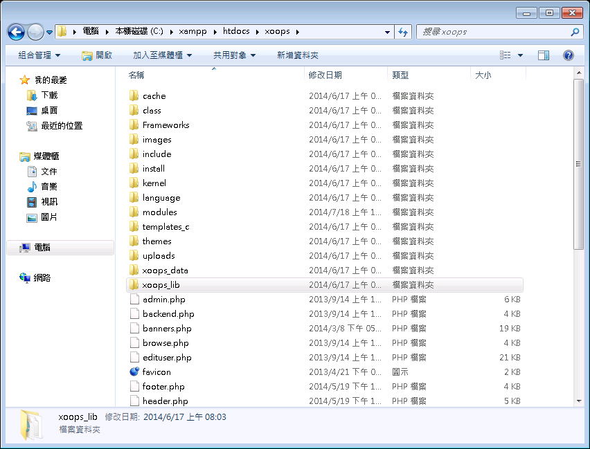
4. c:\xampp\htdocs\xoops 內的 xoops_data 和 xoops_lib 搬移到 c:\xampp
5. 開啟網頁 http://[你的IP]/xoops 或是只用在本機上 http://localhost/xoops
6. 幾個重要安裝畫面
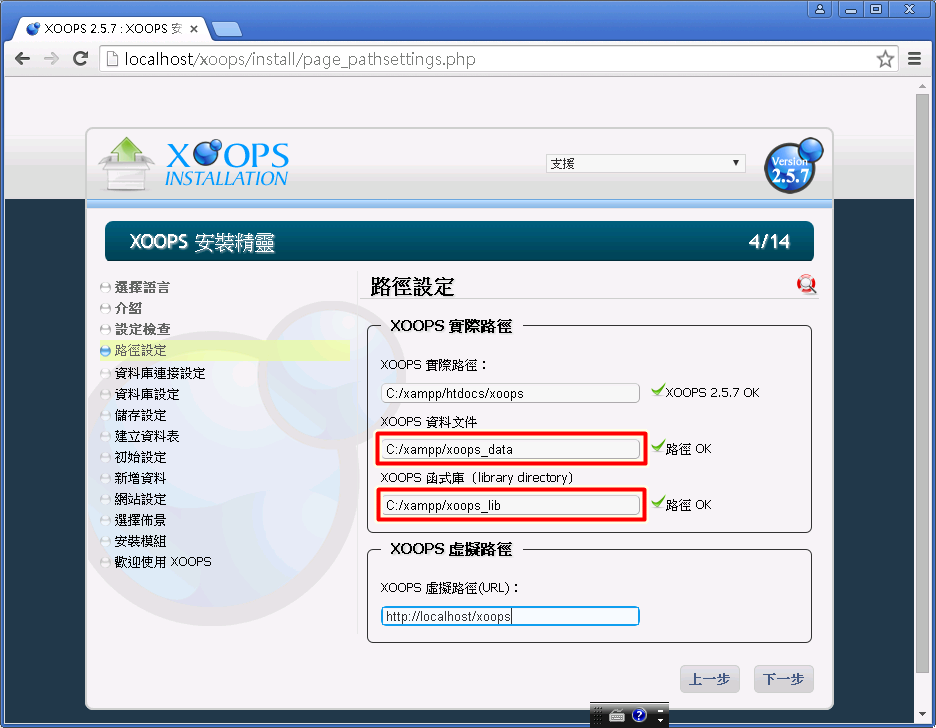
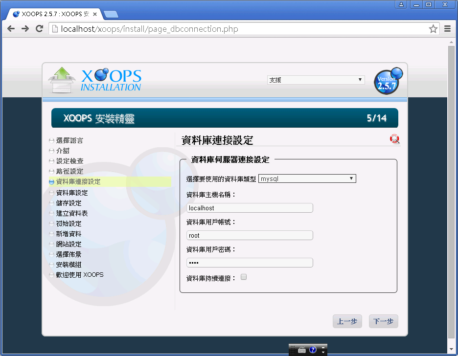
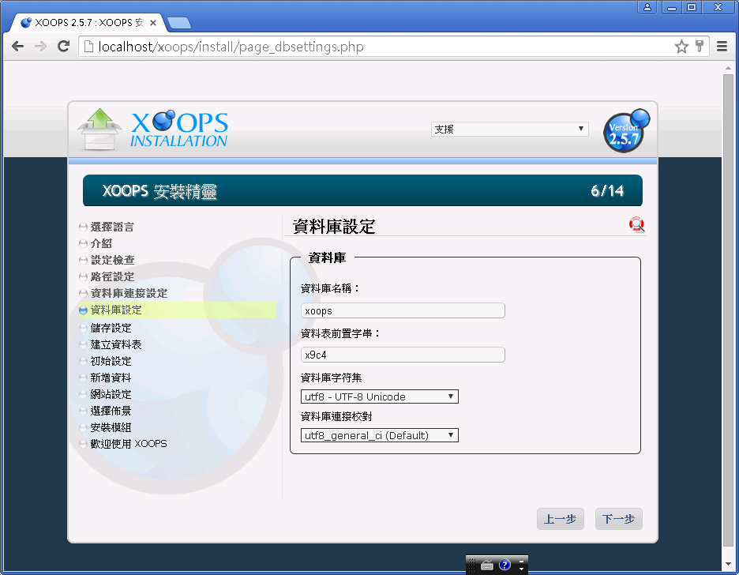
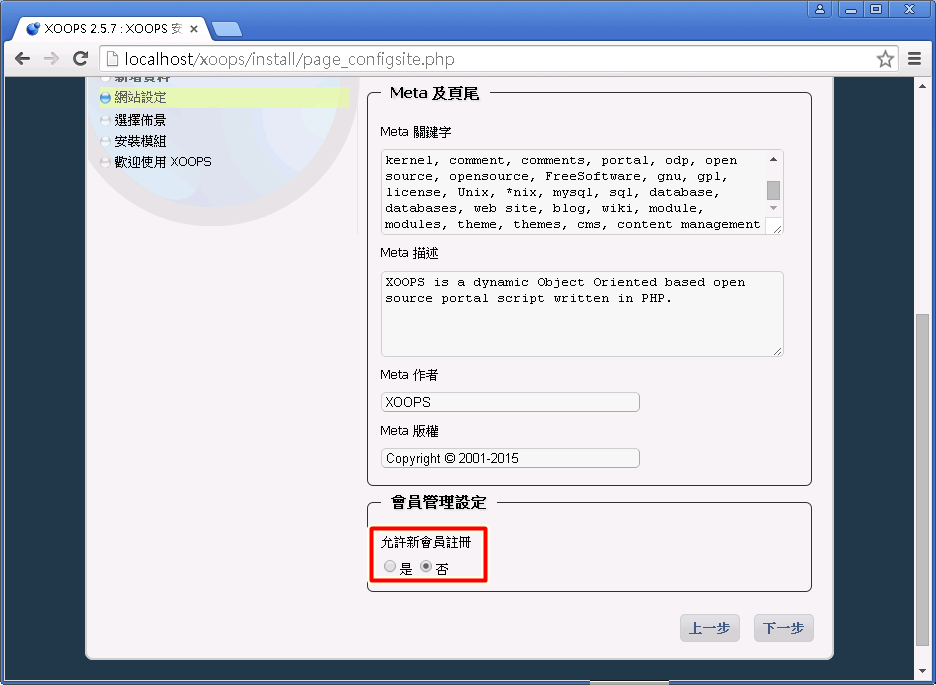
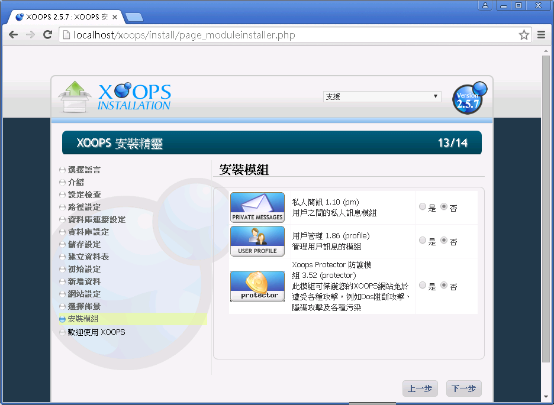
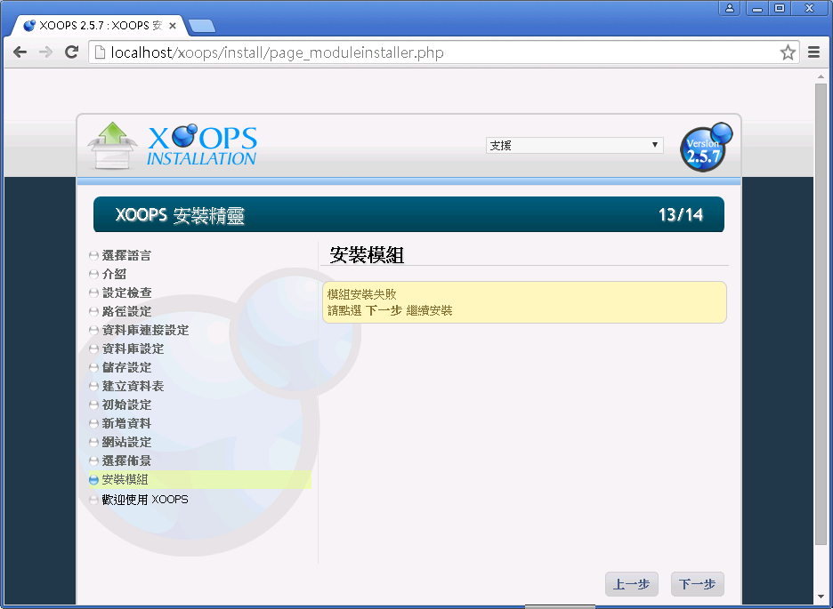
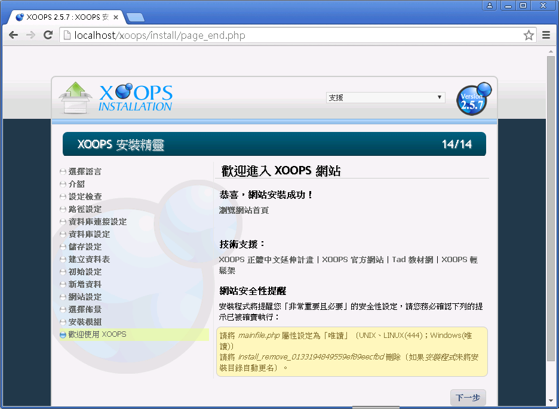
Windows 版本可能已經自動將 mainfile.php 屬性設定為「唯讀」

### 安裝站長工具箱
1. 下載 Tad Tools，解壓縮到 C:\xampp\htdocs\xoops\modules
2. 下載 Tad Adm 站長工具箱，解壓縮到 C:\xampp\htdocs\xoops\modules
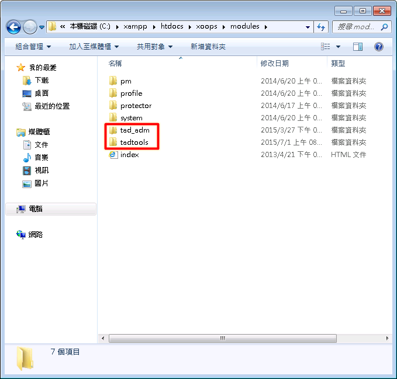
3. 進入管理區->模組->安裝模組 
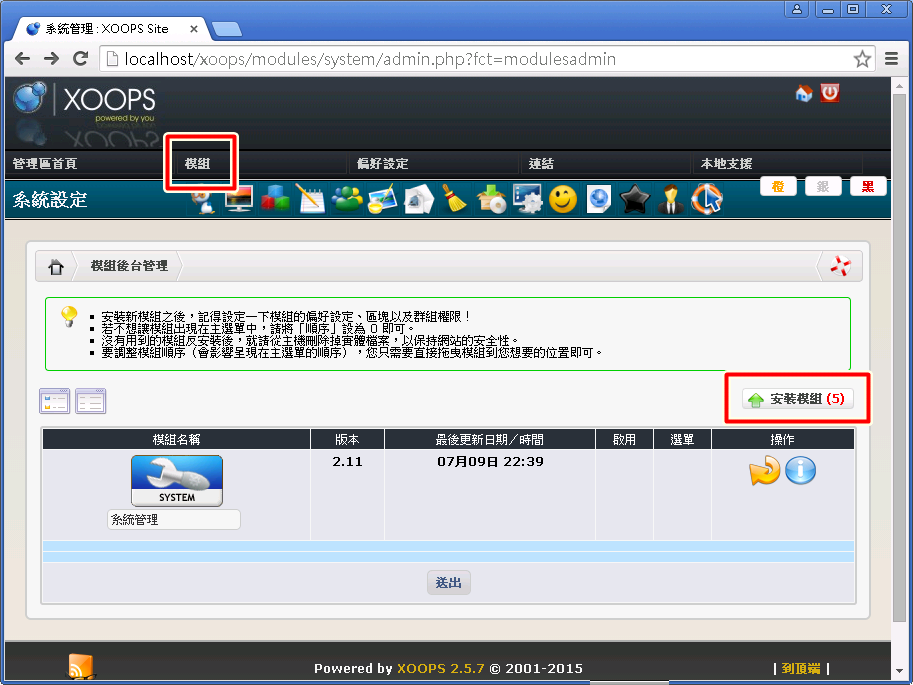
4. 點選綠色箭頭進行安裝
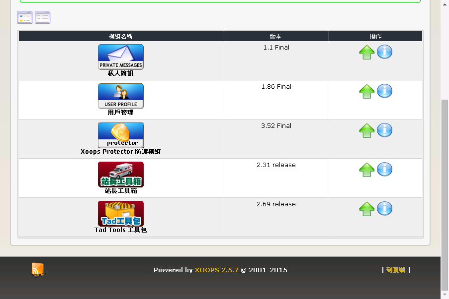
5. 進入管理區->模組->Tad Tools 工具包，點選初始設定
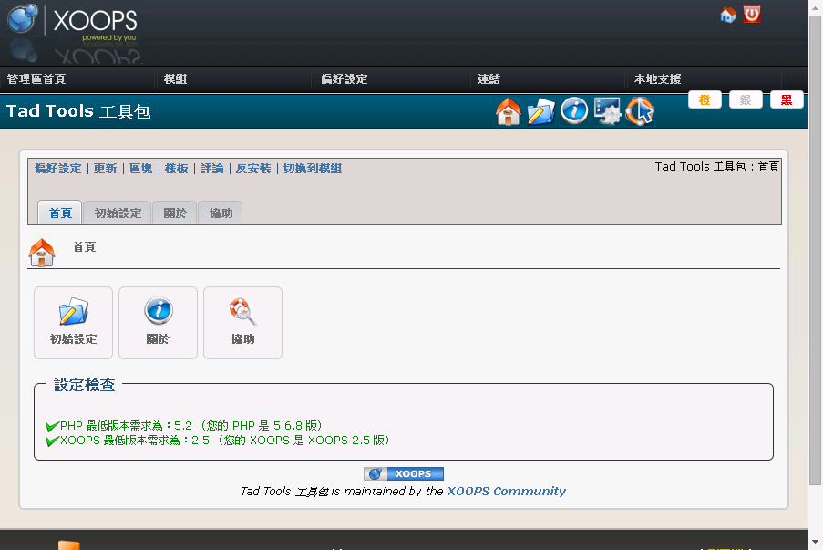
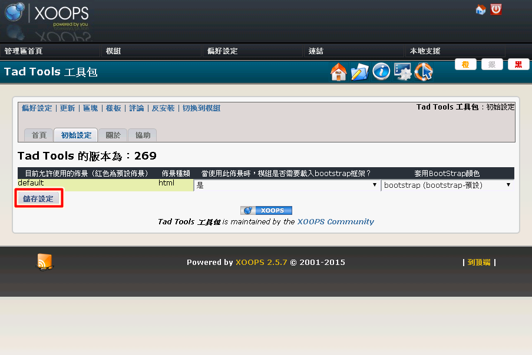
6. 進入管理區->模組->站長工具箱，升級或是安裝模組
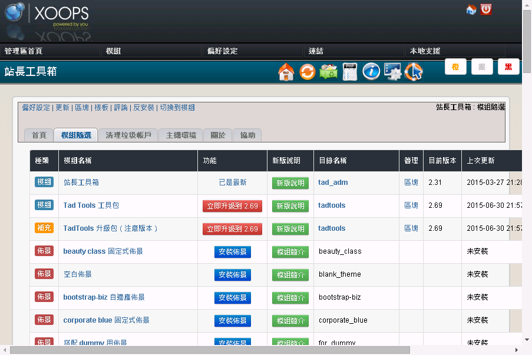

### 安裝佈景
1. 安裝佈景也要安裝[Tad Themes 佈景管理]
2. 安裝佈景後，有時候也要重新進入[Tad Tools 工具包]，進行初始設定

